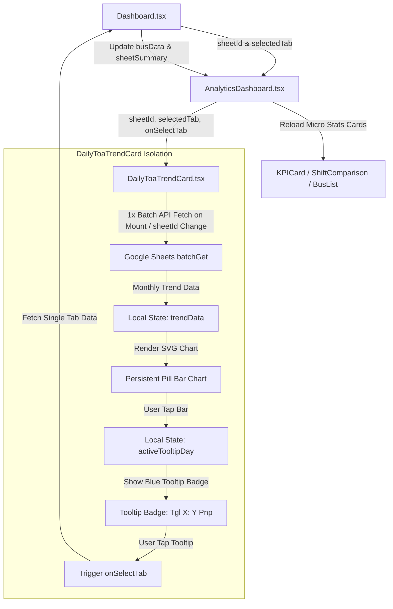

# Desain Arsitektur Persistensi & Caching Komponen Tren TOA Harian (`DailyToaTrendCard`)

## 1. Ringkasan Latar Belakang & Masalah

Saat ini, komponen **Tren TOA Harian** (`DailyToaTrendCard`) bertindak sebagai navigator tanggal interaktif di mana pengguna dapat men-tap balok tanggal untuk memilih tanggal yang ingin dianalisis.

Namun, ketika `selectedTab` berganti, komponen `DailyToaTrendCard` dapat ikut terpicu re-fetch/loading ulang jika dipicu oleh pemanggilan handler di level parent `Dashboard.tsx`. Karena data Tren TOA Harian merupakan **data makro bulanan (Tgl 1 - Max Day)** yang sekali diambil memuat seluruh tanggal dalam 1 batch HTTP request (`batchGet`), memuat ulang grafik tren TOA setiap kali pengguna hanya memilih tanggal harian adalah tidak efisien dan merusak pengalaman visual (_visual flicker_).

## 2. Solusi Desain (_Persistent & Decoupled State_)

1. **Persistensi Data Makro Bulanan (_Persistent Monthly State_)**:
   - `DailyToaTrendCard` menyimpan data bulanan dalam _state_ lokal yang hanya dimuat **1 kali** saat komponen di-mount atau ketika `sheetId` (rute/link spreadsheet) berubah.
   - Grafik tren TOA **TIDAK AKAN** memicu _loading spinner_ atau melakukan re-fetch HTTP ke Google Sheets saat terjadi perubahan `selectedTab` (pilihan tanggal harian).
2. **Kondisi Re-fetch (Reset & Reload)**:
   - Data Tren TOA Harian hanya akan di-fetch ulang dari Google Sheets jika:
     1. User mengganti **Rute/Link Spreadsheet** (`sheetId` berubah).
     2. User melakukan **Pull-to-Refresh** atau aksi Refresh Manual.
3. **Respon Interaksi Visual Balok Tanggal**:
   - Balok yang di-tap langsung berubah warna menjadi **Electric Royal Blue** (`#60a5fa`).
   - Lencana _tooltip_ (`Tgl X: Y Pnp`) muncul secara melayang di atas balok tersebut dengan padding lega (`width="96"`, `height="20"`).
   - Men-tap lencana _tooltip_ mengeksekusi pemindahan tanggal aktif aplikasi (`onSelectTab`) untuk memuat data harian mikro pada `KPICard`, `ShiftComparisonCard`, `CompletionStatusCard`, dan `BusList` tanpa mengganggu grafik Tren TOA Harian.

## 3. Komponen & Alur Data

## 4. Rencana Verifikasi

1. **Verifikasi Kompilasi & Build**: Jalankan `pnpm run build` (`tsc -b && vite build`) untuk memastikan 0 type error.
2. **Verifikasi UX**: Pastikan memilih balok tanggal tidak memicu _loading spinner_ pada grafik tren TOA, sementara komponen-komponen analitik di bawahnya dan halaman input shift memuat data tanggal baru secara instan.
