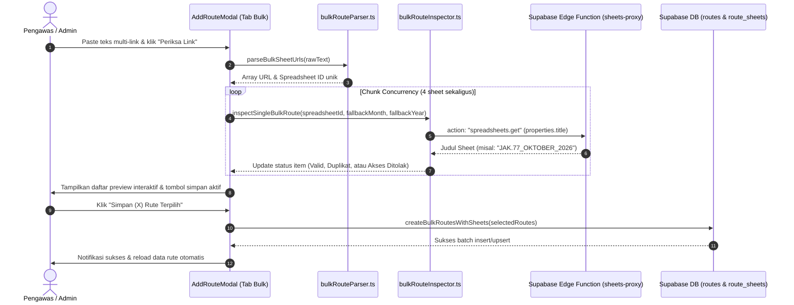

# Spesifikasi Desain: Fitur Bulk Add Rute Spreadsheet (SS_PDO)

**Tanggal:** 2026-10-05  
**Status:** Disetujui (Approved)  
**Tujuan:** Memungkinkan pengawas/admin menambahkan banyak link Google Sheets rute sekaligus dalam satu kali proses salin-tempel (*copy-paste*), dengan deteksi otomatis kode rute, bulan, tahun, serta validasi hak akses Google Service Account secara interaktif.

---

## 1. Latar Belakang & Masalah

Pada awal setiap bulan atau penambahan periode baru, pengawas operasional harus mendaftarkan 16–20 rute bus (contoh: JAK.115, JAK.77, JAK.15, dll). Sebelumnya, proses penambahan rute hanya dapat dilakukan satu per satu:
1. Membuka modal "Tambah Rute".
2. Mengetik kode trayek rute.
3. Memilih bulan dan tahun.
4. Menempel (*paste*) URL Google Sheets satu per satu.
5. Menunggu validasi akses, lalu menekan Simpan.
6. Mengulangi proses tersebut sebanyak 16–20 kali.

Di Google Drive, pengawas dapat dengan mudah memilih (*multi-select*) 16 file sekaligus dan menyalin linknya dalam bentuk daftar URL. Fitur **Bulk Add Rute** ini dirancang untuk memanfaatkan alur kerja tersebut.

---

## 2. Kebutuhan Pengguna & Skenario Lapangan

- **Skenario:** Pengawas menyalin 16 link file Google Sheets dari Google Drive (menghasilkan teks daftar URL yang dipisah koma atau dalam kurung siku `[url1, url2, ...]`).
- **Aksi:** Pengawas membuka modal *Tambah Rute* $\rightarrow$ berpindah ke tab *Banyak Sekaligus (Bulk)* $\rightarrow$ menempelkan teks tersebut ke textarea $\rightarrow$ menekan tombol *Periksa Link*.
- **Hasil yang Diharapkan:**
  1. Sistem otomatis mengekstrak semua URL unik dan spreadsheet ID.
  2. Sistem melakukan inspeksi metadata ke Google Sheets API secara paralel (4 sheet sekaligus dengan konkurensi terkontrol).
  3. Sistem mengekstrak judul spreadsheet (misal: `JAK.77_OKTOBER_2026` $\rightarrow$ Kode Rute: `JAK.77`, Bulan: `10`, Tahun: `2026`).
  4. Sistem menyajikan daftar pratinjau (*preview list*) interaktif yang menampilkan status tiap rute:
     - 🟢 **Siap Simpan:** Akses valid, judul terurai, belum ada di DB.
     - 🟡 **Sudah Ada (Duplikat):** Periode rute ini sudah tersimpan di database.
     - 🔴 **Akses Ditolak / Tidak Ditemukan:** Spreadsheet belum di-share ke Service Account.
  5. Pengawas dapat menekan tombol *Simpan Semua (X Rute Terpilih)* untuk menyimpan seluruh rute yang valid ke Supabase secara serentak.

---

## 3. Arsitektur & Alur Data



---

## 4. Spesifikasi Komponen & Modul Kode

### 4.1 Parser Teks Fleksibel (`src/utils/bulkRouteParser.ts`)
- Menerima `rawText: string`.
- Mendukung variasi format:
  - Format kurung siku Google Drive: `[https://docs.google.com/spreadsheets/d/..., https://...]`
  - Format dipisah koma atau spasi.
  - Format multi-baris (baris baru `\n`).
- Menggunakan regex ekstraksi Spreadsheet ID: `/\/spreadsheets\/d\/([a-zA-Z0-9-_]{15,})/g`.
- Menghasilkan array objek:
  ```ts
  interface ParsedBulkUrlItem {
    id: string; // spreadsheetId unik
    originalUrl: string;
    cleanUrl: string; // URL bersih tanpa query string
  }
  ```
- Menghilangkan entri duplikat di dalam batch input yang sama.

### 4.2 Inspector & Metadata Resolver (`src/utils/bulkRouteInspector.ts`)
- Fungsi: `inspectBulkRoutesWithConcurrency(items, fallbackMonth, fallbackYear, existingFlatSheets, onProgress)`
- Concurrency limit: Maksimal 4 request simultan (`p-limit` atau batch chunking native).
- Ekstraksi judul spreadsheet menggunakan pola regex:
  - `/(JAK\.\d+[A-Z]?)[_-\s]+([A-Z]+)[._-\s]+(\d{4})/i`
  - Contoh: `JAK.77_OKTOBER_2026` $\rightarrow$ `routeCode = "JAK.77"`, `month = 10`, `year = 2026`.
  - Contoh: `JAK.15_OKTOBER._2026` $\rightarrow$ `routeCode = "JAK.15"`, `month = 10`, `year = 2026`.
- Mapping nama bulan Indonesia ke angka 1–12 (Januari=1, Februari=2, ..., Oktober=10, ..., Desember=12).
- **Fallback Rule:** Jika judul sheet tidak memuat bulan/tahun spesifik (misal hanya `JAK.115`), gunakan `fallbackMonth` dan `fallbackYear` dari dropdown form.
- Deteksi duplikasi database: Cocokkan `routeCode + month + year` terhadap `flatSheets` yang telah dimuat di sistem.
- Status per item:
  - `'pending'`: Menunggu antrean inspeksi.
  - `'inspecting'`: Sedang memanggil API.
  - `'ready'`: Siap disimpan (hijau).
  - `'duplicate'`: Sudah ada di database (kuning).
  - `'error'`: Akses ditolak/403/404 atau jaringan putus (merah).

### 4.3 UI Modul Tambah Rute (`src/components/routeSelector/AddRouteModal.tsx`)
- Menambahkan **Segmented Tab Switcher** di bagian atas modal:
  - Tab 1: `Satu Rute` (form single existing).
  - Tab 2: `Banyak Sekaligus (Bulk)` (fitur baru).
- Pada Tab Bulk:
  - Dropdown Bulan & Tahun default (sebagai fallback dan acuan umum).
  - Textarea input lapang dengan font monospace dan placeholder informatif.
  - Tombol aksi `[ 🔍 Lacak & Periksa Link ]`.
  - Bar progres dan teks counter: *"Memeriksa rute (8/16)..."*.
  - Komponen Daftar Preview:
    - Menampilkan kartu/tabel per rute dengan checkbox.
    - Menampilkan badge kode rute, bulan-tahun, dan badge status warna.
    - Untuk item berstatus error 403, sediakan tombol mini `[Salin Email Service Account]`.
  - Tombol Simpan Bulk: `[ Simpan (X) Rute Terpilih ]`.

### 4.4 Layanan Data Database (`src/services/routes/routes.ts`)
- Fungsi baru: `createBulkRoutesWithSheets(routesToCreate: Array<...>)`
- Alur:
  1. Kumpulkan seluruh `route_code` unik, lakukan upsert ke tabel `routes`.
  2. Dapatkan map `route_code` $\rightarrow$ `route_id`.
  3. Batch insert ke tabel `route_sheets` untuk seluruh rute yang belum ada.
  4. Perbarui cache lokal `fetchRoutesWithSheets()`.
  5. Kirim log aktivitas telemetri: `BULK_CREATE_ROUTES`.

### 4.5 Standar Kamus Teks Sentral (`src/constants/texts/text_dashboard.ts`)
- Seluruh teks label, placeholder, status badge, dan pesan modal ditempatkan pada `TEXT_DASHBOARD.ROUTE_SELECTOR.BULK_ADD`:
  - `TAB_SINGLE`: "Satu Rute"
  - `TAB_BULK`: "Banyak Sekaligus (Bulk)"
  - `TEXTAREA_PLACEHOLDER`: "Tempel link Google Sheets di sini...\nContoh:\n[https://docs.google.com/spreadsheets/d/...,\nhttps://docs.google.com/spreadsheets/d/...]"
  - `BTN_INSPECT`: "Lacak & Periksa Link"
  - `INSPECTING_PROGRESS`: (current: number, total: number) => `Memeriksa rute (${current}/${total})...`
  - `STATUS_READY`: "Siap Disimpan"
  - `STATUS_DUPLICATE`: "Sudah Terdaftar"
  - `STATUS_ERROR`: "Akses Ditolak / Tidak Ditemukan"
  - `BTN_SAVE_BULK`: (count: number) => `Simpan ${count} Rute Terpilih`
  - `SAVE_SUCCESS`: (count: number) => `Berhasil menyimpan ${count} rute baru.`

---

## 5. Mitigasi Risiko & Edge Cases

| Kasus Khusus / Edge Case | Dampak | Mitigasi Solusi |
|---|---|---|
| Link di-paste memiliki format kurung siku `[...]` bawaan copy Google Drive | Parsing URL gagal jika hanya split koma | Regex ekstraksi universal `/\/spreadsheets\/d\/([a-zA-Z0-9-_]{15,})/g` mengabaikan seluruh kurung dan whitespace. |
| Ada link duplikat di dalam teks input | Double insert request | Parser melakukan deduplikasi berdasarkan `spreadsheetId` sebelum inspeksi dimulai. |
| Judul sheet memiliki titik atau spasi aneh (misal: `JAK.15_OKTOBER._2026`) | Gagal mengekstrak nama bulan | Regex fleksibel `[._-\s]+` dan normalisasi sanitasi string sebelum pencocokan nama bulan. |
| Judul sheet tidak mengandung nama bulan/tahun (misal hanya `JAK.115`) | Nilai bulan & tahun kosong | Otomatis menggunakan nilai `fallbackMonth` dan `fallbackYear` dari dropdown form. |
| Salah satu sheet gagal diakses (403/404) | Seluruh batch batal jika serial | Tiap item diinspeksi mandiri; item gagal diberi tanda merah, item valid tetap bisa disimpan. |
| Jumlah link sangat banyak (misal 30 rute) | Memori ponsel terbebani jika request dilepas serentak | Concurrency chunking dibatasi 4 request paralel per gelombang. |

---

## 6. Rencana Pengujian (Quality Gates)

1. **Unit Test Parser (`src/utils/bulkRouteParser.test.ts`):**
   - Menguji parsing format array Google Drive `[url1, url2]`.
   - Menguji parsing multi-baris dan pemisahan koma.
   - Menguji pembersihan query string dan deduplikasi ID.
2. **Unit Test Inspector (`src/utils/bulkRouteInspector.test.ts`):**
   - Menguji ekstraksi judul variasi (`JAK.77_OKTOBER_2026`, `JAK.15_OKTOBER._2026`, format polos).
   - Menguji deteksi duplikasi terhadap database.
3. **Kamus Teks Integrity Test (`src/constants/texts/texts.test.ts`):**
   - Memastikan tidak ada hardcoded UI strings dan seluruh teks terdaftar.
4. **Build & Test Verification:**
   - `pnpm vitest run src/` lulus 100%.
   - `pnpm run build` (`tsc -b`) lulus 0 error.
