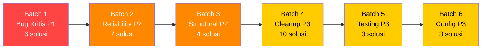

# 🛠️ Rekomendasi Solusi — SS_PDO Refactor 6

> **Referensi:** [01_daftar_masalah_ss_pdo_refactor6.md](file:///d:/MINE/SS_PDO/refactor-ss-pdo/refact_6/01_daftar_masalah_ss_pdo_refactor6.md)
> **Prinsip:** Minimal disruption, maximal impact. Setiap solusi harus backward-compatible.

---

## Prioritas Implementasi

| Prioritas | Kriteria | Warna |
|-----------|----------|-------|
| **P1** | Bug langsung terasa user, risiko data loss | 🔴 |
| **P2** | Reliability/UX penting, tech debt berat | 🟠 |
| **P3** | Cleanup, optimization, nice-to-have | 🟡 |

---

## Batch 1: 🔴 Bug Kritis User-Facing (P1)

### SOL-R6-007 — Indikator Error pada Chart Tren (R6-007)
**Masalah:** `getMonthlyToaTrend` mengembalikan data dummy saat error tanpa indikasi ke user.

**Solusi:**
1. Ubah return type `getMonthlyToaTrend` menjadi `{ data: ToaTrend[], status: 'live' | 'error' }`
2. Saat catch error non-auth, set `status: 'error'` dan sertakan `message`
3. Di komponen `AnalyticsDashboard` / chart, tampilkan banner peringatan di atas chart jika `status === 'error'`:
   ```
   "⚠️ Data tren tidak tersedia saat ini. Pastikan koneksi internet stabil."
   ```
4. Jangan tampilkan garis chart sama sekali jika data kosong karena error (bukan karena memang 0)

**Files:** `googleSheets.ts`, `AnalyticsDashboard.tsx`

---

### SOL-R6-021 — Fix Input Keterangan Mode ALL yang Diabaikan (R6-021)
**Masalah:** Di mode ALL, tab "Catatan" punya input keterangan terpisah yang tidak terbaca oleh `preConfirm`.

**Solusi:**
1. **Hapus** `renderSmartKeteranganSection` dari panel `swal-notes-panel` (tab Catatan di mode ALL)
2. Cukup gunakan **satu instance** keterangan input di panel progressive chips (yang sudah ada)
3. Di panel Catatan, tampilkan **read-only display** dari catatan yang sedang aktif:
   ```html
   <div class="swal-current-note-display">
     Catatan aktif: <strong>${resolvedKeterangan || '-'}</strong>
   </div>
   ```
4. Alternatif: Jika memang ingin input keterangan di panel Catatan, ubah ID-nya agar sinkron — keduanya menulis ke `swal-input-keterangan` yang sama (tapi ini berisiko UX membingungkan)

> [!IMPORTANT]
> Opsi 1 (hapus duplikat) lebih aman. Opsi 2 perlu sinkronisasi dua-arah antar input yang rumit.

**Files:** `alertUtils.ts`

---

### SOL-R6-025 — Fix Urutan Prioritas Warna Keterangan (R6-025)
**Masalah:** `getKeteranganColor` match "OFF" terlalu greedy, override BA.01/NP/EVDAL.

**Solusi:**
Ubah urutan pengecekan menjadi **paling spesifik duluan**:
1. BA.01-04 → Skyblue
2. NP1, NP2 → Skyblue
3. TO EVDAL → Merah
4. OFF (exact match atau `^OFF`) → Kuning
5. Lainnya → Hijau Muda

```typescript
export const getKeteranganColor = (keterangan?: string): GoogleColor | null => {
  if (!keterangan || !keterangan.trim()) return null;
  const upper = keterangan.trim().toUpperCase();

  // 1. BA.01-04, NP1, NP2 → Skyblue (prioritas tertinggi)
  if (/BA\.0[1-4]/i.test(upper) || /\bNP\s*[12]\b/i.test(upper)) {
    return { red: 0.53, green: 0.81, blue: 0.98 };
  }
  // 2. TO EVDAL → Merah
  if (/\bTO\s*[-.]?\s*EVDAL\b/i.test(upper)) {
    return { red: 0.95, green: 0.35, blue: 0.35 };
  }
  // 3. OFF (word boundary) → Kuning
  if (/\bOFF\b/i.test(upper)) {
    return { red: 1.0, green: 0.95, blue: 0.3 };
  }
  // 4. Catatan lainnya → Hijau Muda
  return { red: 0.56, green: 0.93, blue: 0.56 };
};
```

**Perubahan kunci:** Gunakan **word boundary** `\b` untuk "OFF" dan pindahkan ke SETELAH BA/NP/EVDAL check. Hapus semua `.includes()` yang redundan.

**Files:** `sheetColorUtils.ts`

---

### SOL-R6-002 — Stabilkan Flow Login: Await UserInfo Sebelum Resolve (R6-002, R6-003)
**Masalah:** `signIn()` bisa resolve sebelum userinfo tersedia.

**Solusi:**
1. Ubah callback `initTokenClient` agar `handleSuccess` dipanggil **di dalam** `.then()` setelah userinfo berhasil, bukan di level `handleSuccess` yang terpisah
2. Jika userinfo fetch gagal, **tetap resolve** signIn (token valid, hanya profil kosong) tapi set flag `PDO_USER_EMAIL = ''` agar LoginScreen bisa handle
3. Di `LoginScreen.handleLogin`, tambahkan guard:
   ```typescript
   const userEmail = localStorage.getItem('PDO_USER_EMAIL');
   if (!userEmail) {
     setError('Gagal memuat informasi akun. Silakan coba login kembali.');
     return;
   }
   ```

**Files:** `googleSheets.ts`, `LoginScreen.tsx`

---

### SOL-R6-014 — Unifikasi `isAuthError` (R6-014)
**Masalah:** Dua implementasi `isAuthError` yang berbeda di `useOfflineSync.ts` dan `googleSheets.ts`.

**Solusi:**
1. Extract `isAuthError` dari `googleSheets.ts` ke `src/utils/errorClassifier.ts` (file baru)
2. Export satu fungsi `isAuthError(err: unknown): boolean` yang comprehensive
3. Gunakan di kedua tempat: `googleSheets.ts` (import) dan `useOfflineSync.ts` (import)
4. Hapus duplikat di `useOfflineSync.ts`

```typescript
// src/utils/errorClassifier.ts
export function isAuthError(err: unknown): boolean {
  if (!err || typeof err !== 'object') return false;
  const e = err as any;
  if (e.status === 401) return true;
  const code = e.result?.error?.code;
  if (code === 401) return true;
  const msg = String(e.message || e.statusText || '').toLowerCase();
  return (
    msg.includes('invalid authentication') ||
    msg.includes('oauth 2 access token') ||
    msg.includes('credentials missing') ||
    msg.includes('api credentials missing') ||
    msg.includes('unauthorized')
  );
}
```

**Files:** Buat `errorClassifier.ts`, edit `googleSheets.ts`, `useOfflineSync.ts`

---

### SOL-R6-022 — Sanitasi HTML Template Literal di alertUtils (R6-022)
**Masalah:** Nilai keterangan di-interpolate langsung ke HTML tanpa escaping.

**Solusi:**
1. Buat helper function `escapeHtml`:
   ```typescript
   function escapeHtml(str: string): string {
     return str.replace(/&/g, '&amp;').replace(/</g, '&lt;')
              .replace(/>/g, '&gt;').replace(/"/g, '&quot;')
              .replace(/'/g, '&#39;');
   }
   ```
2. Terapkan di semua template literal yang interpolate data user:
   - `value="${escapeHtml(initialDetail)}"`
   - `${escapeHtml(bus.unit)}`
   - dst.

**Files:** `alertUtils.ts`

---

## Batch 2: 🟠 Reliability & UX (P2)

### SOL-R6-011 — Graceful Fallback Login Saat Supabase Offline (R6-011)
**Masalah:** User ditolak login saat Supabase unreachable.

**Solusi:**
1. Di `verifyUserProfile`, jika error adalah network error:
   - Cek `localStorage` untuk `PDO_LAST_VERIFIED_PROFILE_<email>`
   - Jika ada dan masih dalam window 7 hari, **izinkan login** dengan data cache
   - Set flag `PDO_PROFILE_VERIFIED_OFFLINE = true`
2. Setelah koneksi pulih, re-verify di background

```typescript
// Pseudocode
try {
  const profile = await supabase.from('user_profiles')...;
  localStorage.setItem(`PDO_LAST_VERIFIED_PROFILE_${email}`, JSON.stringify({
    profile, verifiedAt: new Date().toISOString()
  }));
  return { isAllowed: true, profile };
} catch (err) {
  if (isNetworkError(err)) {
    const cached = localStorage.getItem(`PDO_LAST_VERIFIED_PROFILE_${email}`);
    if (cached) {
      const { profile, verifiedAt } = JSON.parse(cached);
      const daysSince = (Date.now() - new Date(verifiedAt).getTime()) / 86400000;
      if (daysSince <= 7) {
        return { isAllowed: true, profile, fromCache: true };
      }
    }
  }
  // Fallback ke reject yang sudah ada
}
```

**Files:** `routeService.ts`

---

### SOL-R6-004 — Prompt Conditional di signIn (R6-004)
**Masalah:** `prompt: 'consent'` selalu dipaksa saat login.

**Solusi:**
- Gunakan `prompt: ''` (empty string) agar Google OAuth memilih sendiri apakah perlu consent atau tidak
- Jika user sudah pernah consent, Google akan skip consent screen
- `prompt: 'consent'` hanya dipaksa jika token sebelumnya memiliki scope yang berbeda

```typescript
tokenClient.requestAccessToken({ prompt: '' });
```

**Files:** `googleSheets.ts`

---

### SOL-R6-005 — Fix Error Handler di refreshTokenInteractiveOrSilent (R6-005)
**Masalah:** `resolve()` dipanggil tanpa menunggu consent kedua.

**Solusi:**
Jangan resolve di handleError saat silent fail. Biarkan second `requestAccessToken` menangani callback `handleSuccess`/`handleError` yang sudah terdaftar.

```typescript
// Di handleError, saat silentOnly=false:
if (!silentOnly) {
  // Jangan resolve/reject di sini — biarkan callback kedua yang handle
  tokenClient.requestAccessToken({ prompt: 'consent' });
  return; // Penting: jangan panggil resolve() di sini
}
reject(err);
```

**Files:** `googleSheets.ts`

---

### SOL-R6-009 — Telemetri Supabase Sync dengan Retry (R6-009)
**Masalah:** `upsertDailyUnitSummaries` fire-and-forget tanpa retry.

**Solusi:**
1. Buat wrapper `upsertWithRetry` dengan 1x retry setelah 3 detik
2. Log warning ke console jika tetap gagal
3. Simpan timestamp terakhir upsert berhasil di localStorage
4. Dashboard bisa menampilkan "Data terakhir disinkronkan: X jam lalu" jika upsert gagal berkepanjangan

**Files:** `googleSheets.ts`

---

### SOL-R6-015 — Stabilkan processQueue Callback (R6-015)
**Masalah:** `options` berubah setiap render, menyebabkan re-attachment listener.

**Solusi:**
Gunakan `useRef` untuk menyimpan callbacks:

```typescript
const onSyncSuccessRef = useRef(options?.onSyncSuccess);
const onAuthErrorRef = useRef(options?.onAuthError);

useEffect(() => {
  onSyncSuccessRef.current = options?.onSyncSuccess;
  onAuthErrorRef.current = options?.onAuthError;
});

const processQueue = useCallback(async () => {
  // Gunakan onSyncSuccessRef.current dan onAuthErrorRef.current
  // ...
}, []); // Dependency array KOSONG — tidak bergantung pada options
```

**Files:** `useOfflineSync.ts`

---

### SOL-R6-027 — Versioning localStorage Cache (R6-027)
**Masalah:** Tidak ada schema version untuk localStorage data.

**Solusi:**
1. Buat konstanta `CACHE_VERSION = 6` (sesuai refactor saat ini)
2. Saat app mount (di `App.tsx`), cek `PDO_CACHE_VERSION`:
   ```typescript
   const currentVersion = localStorage.getItem('PDO_CACHE_VERSION');
   if (currentVersion !== String(CACHE_VERSION)) {
     // Clear semua cache kecuali auth token dan theme
     const keysToKeep = ['PDO_IS_SIGNED_IN', 'GAPI_ACCESS_TOKEN', 'PDO_THEME', 'PDO_USER_EMAIL', 'PDO_USER_NAME', 'PDO_USER_AVATAR'];
     Object.keys(localStorage).forEach(key => {
       if (key.startsWith('PDO_') && !keysToKeep.includes(key)) {
         localStorage.removeItem(key);
       }
     });
     localStorage.setItem('PDO_CACHE_VERSION', String(CACHE_VERSION));
   }
   ```

**Files:** `App.tsx`

---

### SOL-R6-033 — Mitigasi Keamanan Token (R6-033)
**Masalah:** Token Google disimpan plaintext di localStorage.

**Solusi (pragmatis):**
- Full encryption di client-side tidak menambah keamanan signifikan (key juga harus di-simpan di client)
- **Solusi realistis:**
  1. Set token expiry sangat pendek (sudah 1 jam by default dari Google)
  2. Jangan simpan token di localStorage — gunakan in-memory saja via module-level variable
  3. Jika memang perlu persist (untuk cold-start), simpan di `sessionStorage` (hilang saat tab ditutup) bukan `localStorage`
  
> [!WARNING]
> Perubahan dari localStorage ke sessionStorage **akan merusak** Aturan Emas #3 (sesi permanen). Trade-off: security vs convenience. **Rekomendasi:** Tetap gunakan localStorage tapi tambahkan `signOut` otomatis saat device idle > 24 jam tanpa heartbeat.

**Files:** `googleSheets.ts`

---

### SOL-R6-017 — Robust Cache Parsing (R6-017, R6-018)
**Masalah:** `JSON.parse` cache routes tanpa proper guard, dan duplikasi 5x.

**Solusi:**
1. Buat utility function `getRoutesFromCache()`:
   ```typescript
   // src/utils/cacheUtils.ts
   export function getRoutesFromCache(): Route[] {
     try {
       const raw = localStorage.getItem('PDO_CACHE_ROUTES');
       if (!raw) return [];
       const parsed = JSON.parse(raw);
       return Array.isArray(parsed) ? parsed : [];
     } catch {
       // Cache corrupt — hapus untuk fresh start
       localStorage.removeItem('PDO_CACHE_ROUTES');
       return [];
     }
   }
   
   export function findSheetByUrl(routes: Route[], sheetUrl: string): { route: Route; sheet: RouteSheet } | null {
     const targetId = extractSpreadsheetId(sheetUrl);
     if (!targetId) return null;
     for (const r of routes) {
       for (const s of r.route_sheets || []) {
         const sId = extractSpreadsheetId(s.sheet_url);
         if (sId === targetId) return { route: r, sheet: s };
       }
     }
     return null;
   }
   ```
2. Replace semua 5 instance di `Dashboard.tsx` dengan utility ini.

**Files:** Buat `cacheUtils.ts`, edit `Dashboard.tsx`

---

## Batch 3: 🟠 Structural Refactor (P2)

### SOL-R6-001 — Pecah `googleSheets.ts` (R6-001)
**Masalah:** God file 1832 baris.

**Solusi:** Pecah menjadi 5 modul:

| File Baru | Isi | Est. Baris |
|-----------|-----|------------|
| `src/services/auth/googleAuth.ts` | signIn, signOut, ensureValidToken, checkSignedInAsync, refreshToken | ~300 |
| `src/services/sheets/sheetReader.ts` | getBusData, getBusRowData, getMonthlyToaTrend, getAccumulatedBusData | ~500 |
| `src/services/sheets/sheetWriter.ts` | updateBusData, updateBulkBusData, formatWholeSheet | ~300 |
| `src/services/sheets/headerParser.ts` | detectHeaderRowAndBuildComposite, findColumnIndex, EXPECTED_HEADERS | ~300 |
| `src/services/sheets/sheetInspector.ts` | inspectSpreadsheetHeader | ~100 |
| `src/services/googleSheets.ts` | Re-export barrel (backward-compatible) | ~30 |

**Kunci:** File `googleSheets.ts` yang lama dijadikan **barrel file** yang re-export semua fungsi dari modul baru. Ini menjaga semua import existing tetap bekerja tanpa perubahan.

**Files:** Banyak file baru, edit `googleSheets.ts`

---

### SOL-R6-020 — Pecah `alertUtils.ts` (R6-020)
**Masalah:** God file 1468 baris.

**Solusi:** Pecah menjadi modul:

| File Baru | Isi | Est. Baris |
|-----------|-----|------------|
| `src/utils/alerts/swalBase.ts` | pdoSwal config, pdoToast, helper (escapeHtml) | ~50 |
| `src/utils/alerts/toasts.ts` | showSuccessToast, showErrorToast, showInfoToast, showWarningToast | ~50 |
| `src/utils/alerts/confirmDialogs.ts` | showDeleteQueueConfirm, showLogoutConfirm, showAuthExpiredAlert, showFormatSheetConfirm, showQueueConflictDialog | ~150 |
| `src/utils/alerts/busInputModal.ts` | showBusInputModal, renderSmartKeteranganSection, setupSmartKeteranganLogic | ~700 |
| `src/utils/alerts/bulkModals.ts` | showBulkTripModal, showBulkCopyKmModal | ~200 |
| `src/utils/alertUtils.ts` | Re-export barrel | ~20 |

**Files:** Banyak file baru, edit `alertUtils.ts`

---

### SOL-R6-035 — Refactor Dashboard State ke useReducer (R6-035)
**Masalah:** 25+ useState di Dashboard.

**Solusi:**
1. Kelompokkan state terkait ke dalam reducer:
   ```typescript
   type DashboardState = {
     sheetUrl: string;
     selectedTab: string;
     isLoading: boolean;
     error: string | null;
     mainTab: 'input' | 'analytics' | 'units';
     busData: BusData[] | null;
     headerMap: HeaderMap | null;
     currentSheetId: string;
     currentTabName: string;
     // ... dst
   };
   ```
2. Gunakan `useReducer` dengan action types yang jelas:
   ```typescript
   type Action =
     | { type: 'SET_LOADING'; payload: boolean }
     | { type: 'SET_DATA'; payload: { data: BusData[]; headerMap: HeaderMap; ... } }
     | { type: 'SET_ERROR'; payload: string }
     // ... dst
   ```

**Catatan:** Ini P2 karena mengurangi risiko bug sekaligus meningkatkan performance (batch state updates).

**Files:** `Dashboard.tsx` (+ kemungkinan custom hook baru `useDashboardState.ts`)

---

### SOL-R6-019 — Hapus IIFE Pattern di Dashboard (R6-019)
**Masalah:** IIFE dalam render menghitung ulang setiap render.

**Solusi:**
1. Pindahkan `currentMonth`/`currentYear` computation ke `useMemo` yang sudah ada (`activeMonth`/`activeYear`)
2. Render `BottomNav`, `ProfileMenuSheet`, `AccumulationSheet` langsung tanpa IIFE:
   ```tsx
   <AccumulationSheet
     currentMonth={activeMonth}
     currentYear={activeYear}
     // ...
   />
   ```

**Files:** `Dashboard.tsx`

---

## Batch 4: 🟡 Cleanup & Optimization (P3)

### SOL-R6-006 — Hapus Dead Code `checkSignedIn()` (R6-006)
**Files:** `googleSheets.ts`

### SOL-R6-008 — Cache Eviction untuk `tabGidCache` (R6-008)
**Solusi:** Clear cache saat `currentSheetId` berubah.

### SOL-R6-010 — Move Import ke Top-Level (R6-010)
**Files:** `googleSheets.ts`

### SOL-R6-016 — Gunakan `crypto.randomUUID()` untuk SyncItem ID (R6-016)
**Files:** `useOfflineSync.ts`

### SOL-R6-024 — Simplify Regex di `sheetColorUtils` (R6-024)
**Files:** `sheetColorUtils.ts`

### SOL-R6-026 — Remove Placeholder Supabase URL (R6-026)
**Solusi:** Throw error saat `!isSupabaseConfigured` bukan buat client dengan placeholder.

### SOL-R6-029 — Label "Akumulasi" di KM Awal Detail (R6-029)
**Solusi:** Tambahkan prefix "(Akumulasi)" pada label KM Awal di mode akumulasi agar user tahu ini bukan KM asli.

### SOL-R6-034 — Log Warning di signOut Revoke (R6-034)
### SOL-R6-036 — Extract Legal Content dari LoginScreen (R6-036)
### SOL-R6-037 — Fix useEffect Dependencies (R6-037)

---

## Batch 5: 🟡 Testing (P3)

### SOL-R6-038 — Tambah Unit Test untuk Modul Kritikal (R6-038)
**Prioritas test baru:**
1. `sheetColorUtils.ts` — Test urutan match (R6-025)
2. `useOfflineSync.ts` — Test collision detection, retry logic, auth error handling
3. `googleSheets.ts` — Test `detectHeaderRowAndBuildComposite`, `getBusData` edge cases

---

## Batch 6: 🟡 Build & Config (P3)

### SOL-R6-030 — Lengkapi PWA Icons (R6-030)
### SOL-R6-031 — Rename Package (R6-031)
### SOL-R6-032 — Verifikasi tsconfig strict mode (R6-032)

---

## Urutan Implementasi yang Direkomendasikan



> [!IMPORTANT]
> **Batch 1 wajib diselesaikan duluan** sebelum batch lainnya karena mengandung fix untuk bug yang langsung terasa user (data dummy chart, keterangan hilang, warna salah).
> 
> **Batch 3 (Structural)** sebaiknya dilakukan **setelah** Batch 1 & 2 selesai dan verified, karena refactoring file besar berisiko regresi.
