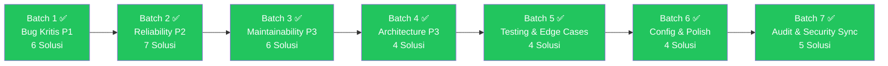

# 🛠️ Rekomendasi Solusi — SS_PDO Refactor 6

> **Referensi:** [01_daftar_masalah_ss_pdo_refactor6.md](file:///d:/MINE/SS_PDO/refactor-ss-pdo/refact_6/01_daftar_masalah_ss_pdo_refactor6.md)  
> **Prinsip:** Minimal disruption, maximal impact. Setiap solusi harus backward-compatible.

---

## Prioritas Implementasi

| Prioritas | Kriteria | Warna | Status |
|---|---|:---:|:---:|
| **Batch 1: P1** | Bug langsung terasa user, risiko data loss | 🔴 | ✅ Selesai |
| **Batch 2: P2** | Reliability/UX penting, offline sync, cache versioning | 🟠 | ✅ Selesai |
| **Batch 3: P3** | Maintainability & Code Health, cleanup dead code | 🟡 | ✅ Selesai |
| **Batch 4: P3** | Architecture & Refactoring, modularisasi god files | 🟡 | ✅ Selesai |
| **Batch 5: P3** | Testing, Edge Cases, & Hardening | 🟡 | ✅ Selesai |
| **Batch 6: P3** | Configuration, PWA Polish, & Service Modularization | 🟡 | ✅ Selesai |

---

## Batch 1: 🔴 Bug Kritis User-Facing (P1) [✅ SELESAI]

### SOL-R6-007 — Indikator Error pada Chart Tren (R6-007)
**Masalah:** `getMonthlyToaTrend` mengembalikan data dummy saat error tanpa indikasi ke user.  
**Solusi:**
1. Return type `getMonthlyToaTrend` menyertakan `status: 'live' | 'error'`
2. Tampilkan banner peringatan ramah pengguna jika data tren offline/gagal dimuat.
3. Garis chart tidak menampilkan data tiruan saat terjadi kegagalan jaringan.  
**Files:** `src/services/googleSheets.ts`, `src/components/DailyToaTrendCard.tsx`

---

### SOL-R6-021 — Fix Input Keterangan Mode ALL (R6-021)
**Masalah:** Di mode ALL, tab "Catatan" punya input keterangan terpisah yang tidak terbaca oleh `preConfirm`.  
**Solusi:** Hapus duplikasi input dan satukan dengan input pintar mode ALL.  
**Files:** `src/utils/alertUtils.ts`, `src/utils/modals/busInputModal.ts`

---

### SOL-R6-025 — Fix Urutan Prioritas Warna Keterangan (R6-025)
**Masalah:** `getKeteranganColor` mencocokkan "OFF" terlalu agresif sehingga menimpa BA.01/NP/EVDAL.  
**Solusi:** Urutkan evaluasi dari yang paling spesifik: BA.01-04 (Skyblue), NP1/NP2 (Skyblue), TO EVDAL (Merah), `\bOFF\b` (Kuning), lainnya (Hijau Muda).  
**Files:** `src/utils/sheetColorUtils.ts`

---

### SOL-R6-002 & SOL-R6-003 — Stabilkan Flow Login: Await UserInfo Sebelum Resolve
**Masalah:** `signIn()` dapat me-resolve token sebelum data profil email pengguna selesai diambil.  
**Solusi:** Await `userinfo` pada saat token Google OAuth diinisialisasi sebelum event `google-login-success` diselesaikan.  
**Files:** `src/services/googleSheets.ts`, `src/components/LoginScreen.tsx`

---

### SOL-R6-014 — Unifikasi `isAuthError` (R6-014)
**Masalah:** Duplikasi fungsi pemeriksa error autentikasi yang tidak konsisten.  
**Solusi:** Buat modul terpusat `src/utils/errorClassifier.ts` (`isAuthError` & `isNetworkError`) dan gunakan di seluruh service/hook.  
**Files:** `src/utils/errorClassifier.ts`, `src/services/googleSheets.ts`, `src/hooks/useOfflineSync.ts`

---

### SOL-R6-022 — Sanitasi HTML Template Literal Modal (R6-022)
**Masalah:** Nilai input unit bus dan keterangan disematkan langsung ke dalam string HTML SweetAlert2.  
**Solusi:** Sanitasi seluruh interpolasi string dinamis menggunakan helper `escapeHtml`.  
**Files:** `src/utils/modals/busInputModal.ts`, `src/utils/alertUtils.ts`

---

## Batch 2: 🟠 Reliability & UX (P2) [✅ SELESAI]

### SOL-R6-011 — Graceful Fallback Login Saat Supabase Offline (R6-011)
**Masalah:** Pengguna ditolak login saat jaringan ke Supabase bermasalah padahal Google OAuth valid.  
**Solusi:** Implementasikan fallback verifikasi profil berbasis cache lokal `PDO_LAST_VERIFIED_PROFILE_<email>` dengan batas masa berlaku (window 7 hari).  
**Files:** `src/services/routeService.ts`

---

### SOL-R6-004 — Prompt Conditional di `signIn()` (R6-004)
**Masalah:** `prompt: 'consent'` selalu memaksa dialog persetujuan Google muncul berulang kali.  
**Solusi:** Ubah menjadi `prompt: ''` agar Google secara cerdas melewatkan layar consent bagi pengguna yang telah memberikan izin sebelumnya.  
**Files:** `src/services/googleSheets.ts`

---

### SOL-R6-005 — Fix Error Handler `refreshTokenInteractiveOrSilent` (R6-005)
**Masalah:** `resolve()` dipanggil prematur saat mode silent gagal tanpa menunggu hasil consent kedua.  
**Solusi:** Hilangkan pemanggilan `resolve()` prematur pada error handler fallback.  
**Files:** `src/services/googleSheets.ts`

---

### SOL-R6-009 — Telemetri Supabase Sync dengan Retry (R6-009)
**Masalah:** `upsertDailyUnitSummaries` bersifat fire-and-forget tanpa mekanisme coba ulang.  
**Solusi:** Bungkus operasi sinkronisasi telemetri dengan retry 1x (delay 3 detik).  
**Files:** `src/services/googleSheets.ts`

---

### SOL-R6-015 — Stabilkan `processQueue` Gunakan `useRef` (R6-015)
**Masalah:** Opsi callback yang berubah pada setiap siklus render memicu re-attachment listener antrean offline.  
**Solusi:** Isolasi callback `onSyncSuccess` dan `onAuthError` menggunakan `useRef`.  
**Files:** `src/hooks/useOfflineSync.ts`

---

### SOL-R6-027 — Versioning & Migrasi Cache localStorage (R6-027)
**Masalah:** Tidak ada migrasi otomatis untuk struktur data cache lama di browser pengguna.  
**Solusi:** Buat konstanta `PDO_APP_CACHE_VERSION = 6` dan helper `checkAndMigrateCache()`.  
**Files:** `src/utils/cacheUtils.ts`, `src/App.tsx`

---

### SOL-R6-017 & SOL-R6-018 — Sentralisasi Utilitas Cache Rute (R6-017, R6-018)
**Masalah:** Duplikasi pembacaan `PDO_CACHE_ROUTES` dan pencarian rute/sheet tersebar di 5 file berbeda.  
**Solusi:** Satukan seluruh logika parsing ke `src/utils/cacheUtils.ts` (`getRoutesFromCache`, `getMonthYearForSheet`, `getRouteCodeForSheet`).  
**Files:** `src/utils/cacheUtils.ts`, `src/components/Dashboard.tsx`, `src/components/AccumulationSheet.tsx`

---

## Batch 3: 🟡 Maintainability & Code Health (P3) [✅ SELESAI]

### SOL-R6-006 — Hapus Dead Code `checkSignedIn()` (R6-006)
**Masalah:** Fungsi sinkron `checkSignedIn()` tidak lagi digunakan dan menduplikasi `checkSignedInAsync()`.  
**Solusi:** Hapus fungsi usang tersebut dari `googleSheets.ts`.  
**Files:** `src/services/googleSheets.ts`

---

### SOL-R6-008 — Cache Eviction & Capping `tabGidCache` (R6-008)
**Masalah:** Cache Tab GID bertambah tanpa batas memori saat pengguna berpindah banyak spreadsheet.  
**Solusi:** Tambahkan fungsi `clearTabGidCache()` dan batas kapasitas maksimum 50 entri (*FIFO Eviction*).  
**Files:** `src/services/googleSheets.ts`

---

### SOL-R6-010 — Pemindahan Import Statement ke Top-Level (R6-010)
**Masalah:** Terdapat beberapa statement `import` inline di tengah-tengah baris fungsi `googleSheets.ts`.  
**Solusi:** Pindahkan seluruh import statement ke bagian paling atas file (*top-level*).  
**Files:** `src/services/googleSheets.ts`

---

### SOL-R6-016 — Standarisasi ID Antrean Menggunakan `crypto.randomUUID()` (R6-016)
**Masalah:** Pembuatan ID antrean acak rawan benturan pada perangkat berkecepatan tinggi.  
**Solusi:** Gunakan Web Standard API `crypto.randomUUID()` dengan fallback timestamp acak.  
**Files:** `src/hooks/useOfflineSync.ts`

---

### SOL-R6-024 — Simplifikasi Regex `sheetColorUtils` (R6-024)
**Masalah:** Pola regex dan pengecekan `.includes()` bertumpuk secara redundan.  
**Solusi:** Bersihkan regex menjadi pola terpadu dan efisien.  
**Files:** `src/utils/sheetColorUtils.ts`

---

### SOL-R6-026 — Proteksi Fallback Client Supabase (R6-026)
**Masalah:** Jika URL env Supabase kosong, fallback mengarah ke dummy domain publik.  
**Solusi:** Arahkan fallback internal ke `http://localhost:54321` yang aman.  
**Files:** `src/services/supabase.ts`

---

## Batch 4: 🟡 Architecture & Refactoring (P3) [✅ SELESAI]

### SOL-R6-036 — Ekstraksi Modal Kebijakan Login (R6-036)
**Masalah:** File `LoginScreen.tsx` berukuran >1300 baris akibat markup modal statis Privacy, Terms, dan Developer Contact.  
**Solusi:** Ekstrak menjadi komponen tersendiri `src/components/login/LegalModals.tsx`.  
**Files:** `src/components/login/LegalModals.tsx`, `src/components/LoginScreen.tsx`

---

### SOL-R6-020 — Modularisasi SweetAlert2 Input Bus Modal (R6-020)
**Masalah:** File `alertUtils.ts` membengkak menjadi god file (>1400 baris).  
**Solusi:** Ekstrak `showBusInputModal`, *smart prefix lock*, preset chips, dan tab controller ke modul khusus `src/utils/modals/busInputModal.ts` dengan barrel re-export.  
**Files:** `src/utils/modals/busInputModal.ts`, `src/utils/alertUtils.ts`

---

### SOL-R6-035 — Ekstraksi Komponen `QueueModal` (R6-035)
**Masalah:** Dialog antrean offline menumpuk langsung di JSX `Dashboard.tsx`.  
**Solusi:** Ekstrak menjadi komponen modular `src/components/QueueModal.tsx`.  
**Files:** `src/components/QueueModal.tsx`, `src/components/Dashboard.tsx`

---

### SOL-R6-019 — Penghapusan Anti-Pattern JSX IIFE di Dashboard (R6-019)
**Masalah:** Pemanggilan fungsi inline `(() => { ... })()` di tengah-tengah JSX tree memperlambat siklus re-render.  
**Solusi:** Hapus IIFE dan gunakan state ter-memoize `activeMonth` & `activeYear`.  
**Files:** `src/components/Dashboard.tsx`

---

## Batch 5: 🟡 Testing, Edge Cases, & Hardening (P3) [✅ SELESAI]

### SOL-R6-038 — Penambahan Test Suite Komprehensif (R6-038)
**Solusi:** Tambah unit test untuk `sheetColorUtils`, `errorClassifier`, collision detection `useOfflineSync`, dan `numberUtils` edge cases.  
**Files:** `src/utils/*.test.ts`

---

### SOL-R6-029 — Label "(Akumulasi)" pada KM Awal Detail Unit (R6-029)
**Solusi:** Tambahkan indikator visual `(Akumulasi)` pada header/label KM Awal di mode akumulasi agar operator memahami bahwa nilai tersebut merupakan nilai acuan hari pertama rentang tanggal.  
**Files:** `src/components/AccumulationSheet.tsx`, `src/components/BusCard.tsx`

---

### SOL-R6-034 — Log Warning Saat OAuth Token Revoke Gagal (R6-034)
**Solusi:** Tangkap error pada `google.accounts.id.revoke` saat `signOut()` agar logout lokal tetap tuntas sembari memberikan logging informatif.  
**Files:** `src/services/googleSheets.ts`

---

### SOL-R6-037 — Audit & Perbaikan Dependencies `useEffect` (R6-037)
**Solusi:** Tinjau dan lengkapi array dependensi `useEffect` pada komponen utama guna mencegah *stale state*.  
**Files:** `src/components/Dashboard.tsx`, `src/components/BusList.tsx`

---

## Batch 6: 🟡 Configuration, PWA Polish, & Service Modularization (P3) [✅ SELESAI]

### SOL-R6-030 — Kelengkapan Ikon & Metadata PWA (R6-030)
**Solusi:** Verifikasi `manifest.webmanifest`, theme-color, dan pastikan ikon PWA lengkap untuk instalasi layar utama ponsel.  
**Files:** `vite.config.ts`, `index.html`

---

### SOL-R6-031 — Standarisasi Nama Paket (R6-031)
**Solusi:** Standarisasi atribut `name` pada `package.json` menjadi `pusm-pdo-app` (bukan placeholder default).  
**Files:** `package.json`

---

### SOL-R6-032 — Verifikasi & Hardening TypeScript Strict Mode (R6-032)
**Solusi:** Pastikan `strict: true` pada `tsconfig.json` dan `tsconfig.app.json` tanpa compiler warning.  
**Files:** `tsconfig.json`, `tsconfig.app.json`

---

### SOL-R6-001 — Modularisasi Total `googleSheets.ts` (R6-001)
**Solusi:** Pecah file `googleSheets.ts` menjadi multi-file terstruktur di `src/services/googleSheets/` (`types.ts`, `auth.ts`, `core.ts`, `mutations.ts`, `analytics.ts`, `index.ts`) dengan barrel re-export tanpa breaking change.  
**Files:** `src/services/googleSheets/*`, `src/services/googleSheets.ts`

---

## Batch 7: 🛡️ Security & Hardening Sync (Audit External V6) [✅ Selesai]

### BUG-48 — Stored XSS Hardening di Seluruh Titik Interpolasi HTML
**Solusi:** Membungkus seluruh titik input atribut HTML dan label di `src/utils/modals/busInputModal.ts` dan `src/utils/alertUtils.ts` dengan `escapeHtml()` tanpa terkecuali.  
**Files:** `src/utils/modals/busInputModal.ts`, `src/utils/alertUtils.ts`

---

### BUG-49 — Penyeragaman Penuh Ekstraksi ID Spreadsheet
**Solusi:** Menyeragamkan seluruh pemanggilan ekstraksi ID di `src/components/Dashboard.tsx` ke fungsi kanonik `extractSpreadsheetId()`.  
**Files:** `src/components/Dashboard.tsx`, `src/utils/sheetIdentity.ts`

---

### BUG-50 — Akurasi Durasi Jam Kerja & Observability Error Heartbeat
**Solusi:** Menghitung durasi aktual detik aktif pengguna di `useUserActivityTracking.ts` (dengan cap 200s mode sleep) dan menambahkan log warning informatif jika terjadi kegagalan jaringan.  
**Files:** `src/hooks/useUserActivityTracking.ts`

---

### BUG-51 & BUG-52 — Transparansi Sesi & Verifikasi Konflik Data
**Solusi:** Menambahkan catatan transparansi pemantauan sesi di `ProfileMenuSheet.tsx` dan memverifikasi ketahanan tabrakan data dengan 153 uji robot otomatis.  
**Files:** `src/components/ProfileMenuSheet.tsx`

---

## Diagram Alur Eksekusi Tersinkronisasi

